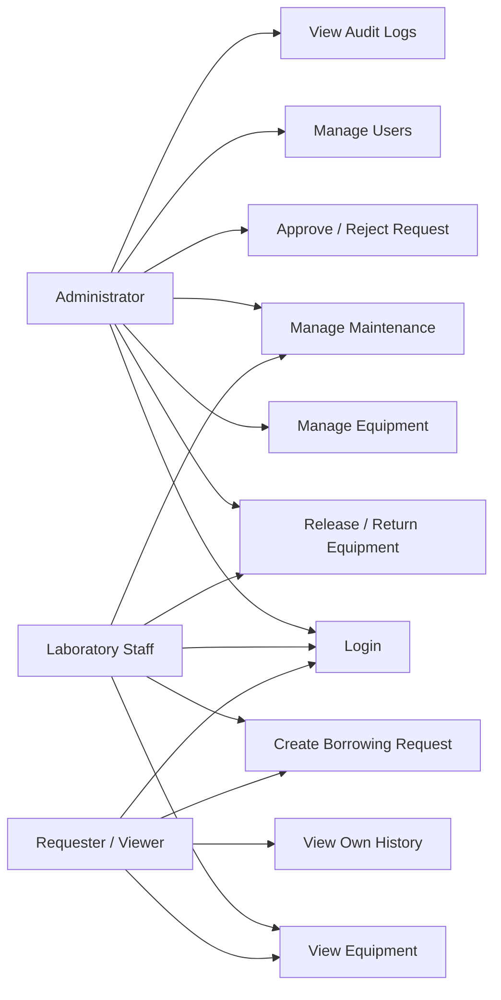
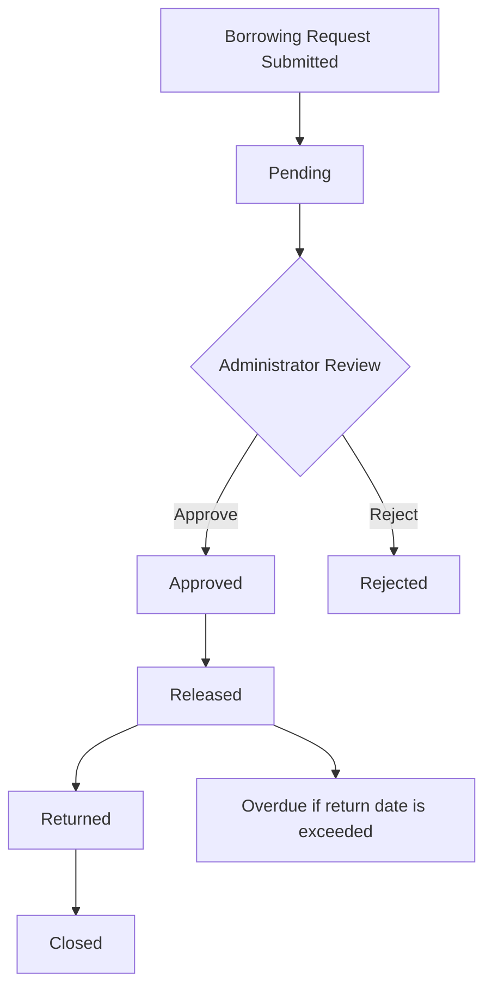
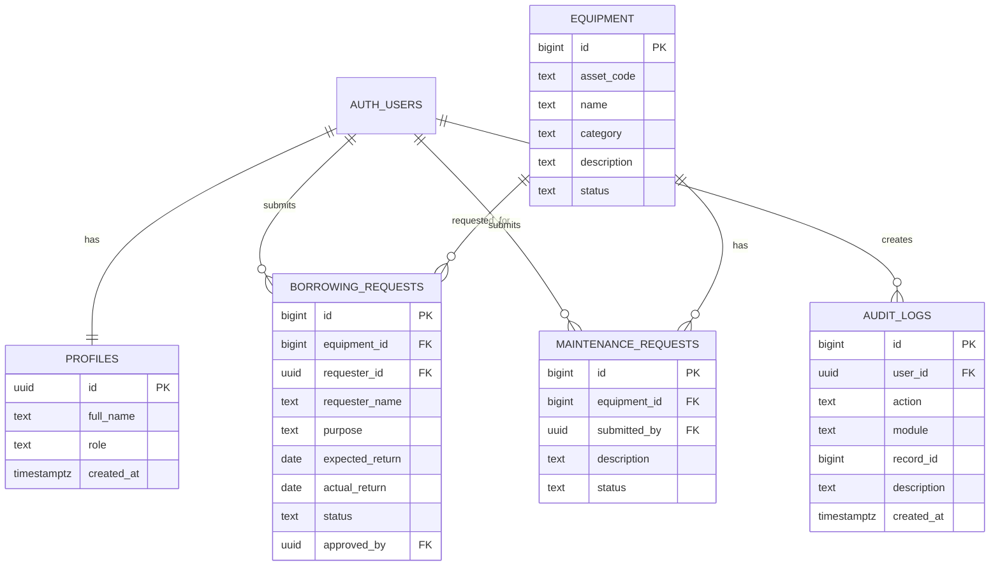

# Laboratory 4 - System Analysis and Design
## Role-Based Asset Transaction and Approval Management

### 1. Problem Statement
The Laboratory Asset and Service Management System needs stronger controls for sensitive asset transactions. Different users perform different tasks, but without role restrictions, approval controls, and activity tracking, unauthorized operations may be possible. The upgraded system provides role-based access, a borrowing approval workflow, validation of equipment status, and an audit trail for important actions.

### 2. Actors
| Actor | Description |
|---|---|
| Administrator | Manages users and equipment, approves/rejects requests, handles maintenance, and views audit logs. |
| Laboratory Staff | Views equipment, processes borrowing and returns, and submits/processes maintenance requests. |
| Requester / Viewer | Views equipment, submits borrowing requests, and views own request history/status. |

### 3. Role-Permission Matrix
| Function | Administrator | Laboratory Staff | Requester / Viewer |
|---|---|---|---|
| Login/Logout | Yes | Yes | Yes |
| View Equipment | Yes | Yes | Yes |
| Manage Equipment | Yes | No | No |
| Submit Borrowing Request | Yes | Yes | Yes |
| View Requests | All | Operational records | Own requests |
| Approve/Reject | Yes | No | No |
| Release Equipment | Yes | Yes | No |
| Process Return | Yes | Yes | No |
| Maintenance | Yes | Yes | Submit only |
| Manage Users/Roles | Yes | No | No |
| View Audit Logs | Yes | No | No |

### 4. Use Cases
- Login
- Logout
- View Dashboard
- View Equipment
- Manage Equipment
- Submit Borrowing Request
- View Request Status and History
- Approve Request
- Reject Request
- Release Equipment
- Process Return
- Submit Maintenance Request
- Complete Maintenance
- Manage User Roles
- View Audit Logs

### 5. Use Case Diagram (Mermaid)

### 6. Borrowing Workflow

### 7. ERD

### 8. Business Rules
1. Only available equipment may be requested.
2. Staff cannot approve their own request.
3. Only Administrator may approve or reject requests.
4. Only Approved requests may be released.
5. Released equipment becomes Borrowed.
6. Returned equipment becomes Available unless damaged.
7. Rejected requests cannot be released.
8. Returned transactions cannot be processed twice.
9. Equipment under Maintenance cannot be borrowed.
10. Sensitive operations must be logged.

### 9. Audit Trail
The `audit_logs` table records the user, action, module, record ID, description, and date/time. Examples include SUBMITTED, APPROVED, REJECTED, RELEASED, RETURNED, DELETED, and ROLE_CHANGED.

### 10. Requirements Traceability Matrix
| ID | Requirement | Implementation | Test |
|---|---|---|---|
| FR-A4-01 | Role-based access | profiles + navigation + RLS | TC-A4-01 |
| FR-A4-02 | Borrowing request | borrowing_requests | TC-A4-02 |
| FR-A4-03 | Approval workflow | approve/reject actions | TC-A4-03/04 |
| FR-A4-04 | Release control | releaseBorrow() | TC-A4-05/06 |
| FR-A4-05 | Return processing | returnBorrow() | TC-A4-07 |
| FR-A4-06 | Audit trail | audit_logs | TC-A4-08 |
| FR-A4-07 | Restricted operations | role checks + RLS | TC-A4-09 |
| FR-A4-08 | Protected pages | Supabase Auth session check | TC-A4-10 |

### 11. Functional Test Results
| Test ID | Scenario | Expected Result | Result |
|---|---|---|---|
| TC-A4-01 | Viewer opens Admin page | Access denied / admin navigation hidden | PASS/FAIL |
| TC-A4-02 | Staff submits request | Saved as Pending | PASS/FAIL |
| TC-A4-03 | Administrator approves | Approved and audit log created | PASS/FAIL |
| TC-A4-04 | Administrator rejects | Status becomes Rejected | PASS/FAIL |
| TC-A4-05 | Release rejected request | Operation blocked | PASS/FAIL |
| TC-A4-06 | Release approved equipment | Equipment becomes Borrowed | PASS/FAIL |
| TC-A4-07 | Return released equipment | Equipment returns to appropriate status | PASS/FAIL |
| TC-A4-08 | Check audit log | Approval entry visible | PASS/FAIL |
| TC-A4-09 | Staff attempts restricted delete | Operation blocked | PASS/FAIL |
| TC-A4-10 | Logout and open protected page | Redirected to login | PASS/FAIL |

### 12. Git Commits
Recommended meaningful commits:
1. `Update database for Lab 4 roles and asset workflow`
2. `Implement role-based interface and authorization`
3. `Implement borrowing approval and return workflow`
4. `Add business rules and audit trail`
5. `Add Lab 4 documentation and testing`
